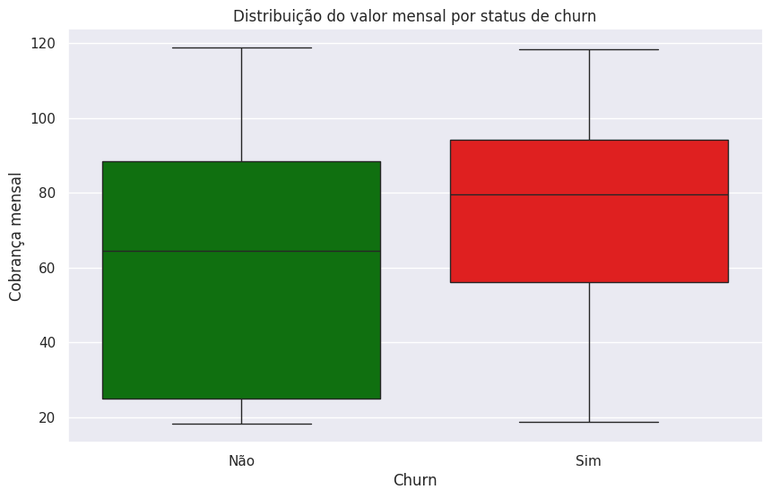
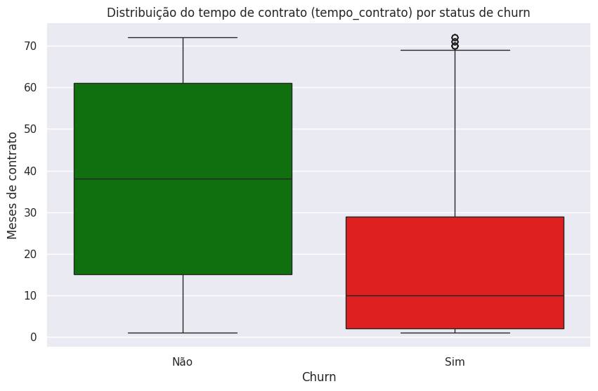

# 📊 Telecom X – Análise de Evasão de Clientes (Churn)

Este projeto tem como objetivo analisar a evasão de clientes (churn) da empresa **Telecom X**, utilizando Python e bibliotecas de análise de dados para identificar padrões, fatores associados ao cancelamento de serviços e oportunidades de retenção.

A análise foi conduzida a partir de dados extraídos de uma API no formato JSON, seguindo boas práticas de **ETL (Extração, Transformação e Carga)** e **Análise Exploratória de Dados (EDA)**, com foco em gerar insights acionáveis para o negócio.

---

## 🎯 Objetivos do Projeto

- Extrair dados de clientes a partir de uma API (JSON)
- Aplicar processos de ETL para preparação e validação dos dados
- Realizar Análise Exploratória de Dados (EDA)
- Identificar os principais fatores associados à evasão de clientes
- Propor estratégias de retenção baseadas em dados

---

## 🗂️ Estrutura do Projeto

- `TelecomX_BR.ipynb`  
  Notebook principal contendo:
  - Extração dos dados via URL
  - Normalização e tratamento do dataset
  - Verificação de qualidade dos dados (duplicados, nulos e valores vazios)
  - Análises exploratórias com visualizações
  - Conclusões e recomendações estratégicas

- `README.md`  
  Documentação do projeto

---

## 🔄 Pipeline de Dados (ETL)

### 🔹 Extração
- Dados obtidos a partir de um arquivo JSON hospedado no GitHub
- Leitura direta via URL utilizando Python

### 🔹 Transformação
- Normalização da estrutura JSON
- Padronização e renomeação das colunas
- Conversão de tipos de dados (ex.: valores monetários)
- Tratamento de valores nulos
- Identificação de valores vazios na variável alvo (`Churn`)
- Criação de subconjunto específico para análises de churn, preservando a integridade da variável central

### 🔹 Carga
- Dados preparados e prontos para análise exploratória no ambiente do Google Colab

---

## 📈 Análise Exploratória de Dados (EDA)

A EDA foi conduzida a partir de dois blocos principais:

### 🔹 Variáveis Categóricas
- Tipo de contrato
- Tipo de serviço de internet
- Método de pagamento
- Serviços adicionais (segurança online, suporte técnico)
- Perfil do cliente (parceiro, dependentes, senioridade)

### 🔹 Variáveis Numéricas
- Tempo de contrato (`tenure`)
- Valor mensal cobrado
- Gasto total acumulado

As visualizações permitiram identificar padrões claros de comportamento associados ao churn.

---

## 🔍 Principais Insights

- Clientes com **contratos mensais** apresentam taxas de churn significativamente mais altas.
- O **tempo de contrato (tenure)** é um dos fatores mais relevantes: clientes que evadem tendem a cancelar nos primeiros meses.
- Clientes com **valores mensais mais elevados** demonstram maior propensão ao churn, indicando sensibilidade à percepção de valor.
- O serviço de **fibra óptica** está associado a taxas mais altas de evasão, sugerindo possíveis problemas de expectativa ou qualidade percebida.
- O método de pagamento **cheque eletrônico** aparece com maior incidência de churn.
- A ausência de **serviços adicionais** (segurança online, suporte técnico) está relacionada a maior evasão.
- Clientes **sem parceiro ou dependentes** tendem a cancelar mais.

---

## 💡 Recomendações Estratégicas

- Fortalecer ações de **onboarding e engajamento nos primeiros meses** de contrato.
- Incentivar a **migração para contratos de longo prazo** (anuais e bienais).
- Reavaliar a **percepção de valor dos planos com maior custo mensal**.
- Investigar e aprimorar a experiência dos clientes de **fibra óptica**.
- Incentivar métodos de **pagamento automático**.
- Promover a adoção de **serviços agregados** como fatores de retenção.

---

## 🛠️ Tecnologias Utilizadas

- Python
- Pandas
- NumPy
- Matplotlib
- Seaborn
- Google Colab

---

## 📈 Principais Visualizações

### Valor Mensal por Status de Churn

### Tempo de Contrato por Status de Churn

---

## ▶️ Como Executar o Projeto

Clone este repositório:

git clone https://github.com/seu-usuario/telecom-x-churn-analysis.git

Abra o notebook TelecomX_BR.ipynb no Google Colab ou em ambiente local com Jupyter Notebook.

Execute as células sequencialmente para reproduzir toda a análise.

---

## 📌 Observações Finais

Este projeto foi desenvolvido com foco em boas práticas de análise de dados, através da metodologia da Alura e do Projeto ONE da Oracle, priorizando decisões metodológicas conscientes, clareza na comunicação dos resultados e conexão direta entre dados e estratégias de negócio.

---

## 🚧 Status do Projeto

✅ **Concluído – Análise Exploratória Finalizada** 
